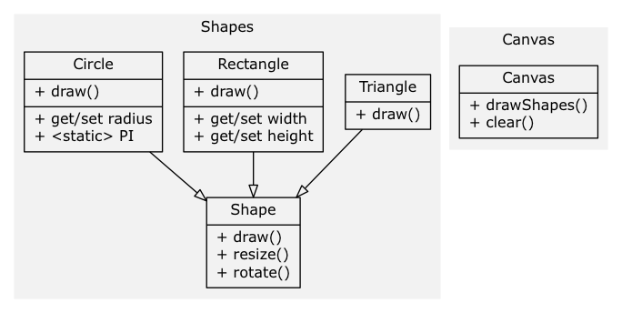

# tsviz
This simple tool creates a UML diagram from typescript modules.



## Installation

```bash
npm install -g tsviz
```
You also need to install [GraphViz](http://www.graphviz.org/download/), including correctly added it to your PATH.

## Usage
```
tsviz <switches> <sources filename/directory> <output.png>

Available switches:
  -d, dependencies: produces the modules dependencies diagram
  -r, recursive: include files in subdirectories (must be non-cyclic)

```

In order to create a diagram for an entire project you simply type:

```bash
tsviz samples/ diagram.png
```

## Configuration
In order to pass additional params to GraphVis, you can create a `tsviz-config.json` file 
in the root directory of your project. 

**Config options**  
```typescript
interface RenderOptions {
    type: string;  // output file type (png, jpeg, ps, ...)
    use: string;  // Graphviz command to use (dot, neato, ...)
    path: string;  // GraphViz path
    G: any;  // graph options
    N: any;  // node options
    E: any;  // edge options
  }
```  

example
```json
{
  "type": "svg",
  "G": {
    "pack": true
  },
  "N": {},
  "E": {}
}
``` 